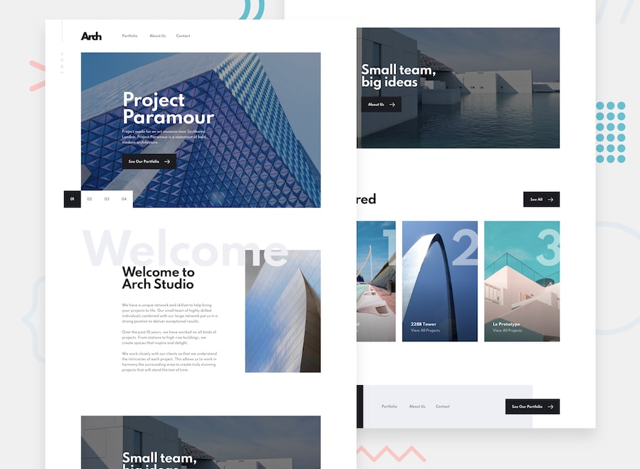

# Arch Studio multi-page website

This is my solution to the [Arch Studio multi-page website challenge on Frontend Mentor](https://www.frontendmentor.io/challenges/arch-studio-multipage-website-wNIbOFYR6), a site with challenges to help with improving coding skills with realistic project building.

## Table of contents

- [Overview](#overview)
  - [The challenge](#the-challenge)
  - [Link](#link)
- [My process](#my-process)
  - [Built with](#built-with)
  - [What I learned](#what-i-learned)
- [Author](#author)

## Overview

### The challenge

The challenge was to create a responsive multi-page website based off of the design files provided by Frontend Mentor, while allowing users to:

- View the optimal layout for each page depending on their device's screen size
- See hover states for all interactive elements throughout the site
- Receive an error message when the contact form is submitted if:
  - The `Name`, `Email` or `Message` fields are empty
  - The `Email` is not formatted correctly
- View actual locations on the contact page map.

### Link

- Solution URL: [On Netlify](https://arch-studio-project047.netlify.app/)

## My process

### Built with

- Semantic HTML5 markup
- CSS custom properties
- Sass
- CSS Grid
- Mobile-first workflow
- [React](https://reactjs.org/) - JS library
- [React Router](https://reactrouter.com/)
- [Leaflet](https://leafletjs.com/) - JS library for interactive maps
- [React-Leaflet](https://react-leaflet.js.org/) - Provides React components for Leaflet maps

### What I learned

This project was an excellent opportunity to reinforce my previous experience with React and learn a number of new things too. I also worked with Sass and Leaflet for the first time, both of which proved to be fairly easy to use.

I'm particularly glad with how the Home page hero slideshow section turned out. Another fun challenge was figuring out how to set up the hero component design shared between the About and Contact pages of the site, with the image being cut in different ways depending on screen size.

## Author

- Chris Williams
